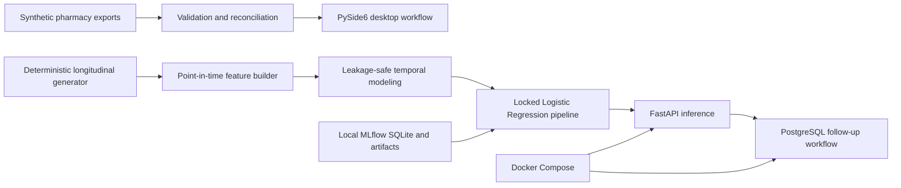

# Pharmacy Reconciliation & Prescription Renewal ML Platform

*An end-to-end Applied ML system for leakage-safe prescription-renewal prediction,
operational follow-up workflows, and containerized deployment using entirely synthetic
pharmacy data.*

[](https://github.com/suuuhailllkhann/Billing-vs-Ordering-Reconciliation/actions/workflows/ci.yml)

> All repository data, identities, medications, prescriptions, insurance records, and
> examples are fictional. Reported model results describe a synthetic simulation and
> must not be interpreted as real pharmacy or patient performance.

## Overview

This project connects two related pharmacy workflows. First, a PySide6 desktop
application validates billing and ordering exports and reconciles medication inventory.
Second, a reproducible longitudinal research pipeline studies whether a zero-refill
prescription receives a new prescription near expected supply exhaustion. The locked
research model is exposed through FastAPI and a PostgreSQL follow-up queue for local,
synthetic workflow testing.

The project progression is:

```text
Reconciliation
→ longitudinal synthetic data
→ leakage-safe ML
→ locked model
→ FastAPI/PostgreSQL workflow
→ Docker Compose
→ observability
→ documented AWS path
```

The current validated deployment is local Docker Compose. AWS deployment is documented
as a possible future path only; no AWS resources have been created.

## What the system does

### Applied ML core

- Generates deterministic fictional patient, prescription, and fill histories over an
  18-month study period, including imperfect refill and renewal behavior.
- Defines a point-in-time prediction observation 10 days before expected supply end.
- Predicts `prescription_renewal_within_window` for eligible zero-refill prescriptions.
- Builds 16 historical features using only information available by observation time.
- Uses chronological Train/Validation/Test partitions and fold-local preprocessing.
- Compares Logistic Regression, Random Forest, XGBoost, and LightGBM baselines, then
  tunes them using five expanding time-series folds and PR-AUC scoring.
- Locks the final model, feature contract, fitting policy, and threshold before the
  single final Test evaluation.
- Includes stability, threshold, error, coefficient/odds-ratio, tree-importance, and
  permutation-importance analyses without reopening the locked decision.
- Records the established modeling history in a local MLflow SQLite store.

### Supporting engineering

- Loads CSV/XLSX billing and ordering exports with deterministic column mapping.
- Blocks ambiguous mappings until a user resolves them and presents concise data-quality
  reports rather than Python errors.
- Reconciles billed and ordered quantities as `MATCHED`, `SHORT`, or `EXTRA`, with
  insurance and patient drill-downs in a PySide6 desktop application.
- Serves the locked pipeline through single and batch FastAPI endpoints.
- Persists eligible predictions, follow-up cases, activities, and explicit resolutions
  through SQLAlchemy, PostgreSQL, and Alembic.
- Runs FastAPI and PostgreSQL locally with Docker Compose and persistent database storage.
- Adds request IDs, privacy-safe aggregate request logs, and separate liveness/readiness
  checks.

## Architecture



The API loads the sole `locked_final` MLflow pipeline. PostgreSQL stores operational Rx
lookup and aggregate prediction/case metadata, not patient identity, feature vectors,
raw payloads, or row-level MLflow inference data.

## Applied ML methodology

The synthetic study runs from 2025-01-01 through 2026-06-30. Eligible observations use:

```text
observation_date = expected_supply_end_date - 10 days
target window = after observation_date through expected_supply_end_date + 7 days
```

The target is positive only when the same fictional patient and exact NDC receive a new
prescription ID inside that window. Observations without a fully observable outcome
window are censored rather than labeled negative.

The fixed chronological split is:

| Partition | Date rule | Purpose |
|---|---|---|
| Train | Before 2026-02-01 | Fitting and time-aware CV |
| Validation | 2026-02-01 through 2026-03-31 | Candidate and threshold analysis |
| Test | From 2026-04-01 | One locked final evaluation |

Identifiers, dates, NDC/Rx fields, identity fields, and the zero-refill eligibility field
are excluded from modeling. Missing refill-interval variability represents insufficient
history: an availability indicator is added and the value is imputed with a median
learned from Train only. Logistic Regression additionally uses `StandardScaler` fitted
within the training data/folds.

The final pre-Test decision was the full 16-feature Logistic Regression pipeline with
`C=0.01`, L2 regularization, SAGA, `max_iter=5000`, Train-only fitting, and threshold
0.50. Test is now consumed and must not be reused for model selection, feature selection,
hyperparameter tuning, or threshold adjustment.

## Final synthetic Test results

The locked model was evaluated once on 376 synthetic Test observations (218 positive,
158 negative; positive rate 57.98%).

| Accuracy | Precision | Recall | F1 | PR-AUC | ROC-AUC |
|---:|---:|---:|---:|---:|---:|
| 0.6383 | 0.6306 | 0.9083 | 0.7444 | 0.7352 | 0.6710 |

Confusion matrix: **TN 42, FP 116, FN 20, TP 198**.

These results reflect deliberately simulated behavior, not clinical effectiveness,
adherence, real-world pharmacy operations, or generalization to an actual population.
The relatively high false-positive workload is documented rather than hidden. Seen- and
unseen-patient results, validation deltas, stability analysis, and post-Test descriptive
error analysis are available in the methodology document.

## Technology stack

| Area | Tools |
|---|---|
| Data and ML | Python, pandas, scikit-learn, XGBoost, LightGBM |
| Experiment tracking | MLflow with local SQLite metadata/artifacts |
| Desktop workflow | PySide6 |
| API | FastAPI, Pydantic, Uvicorn |
| Persistence | PostgreSQL, SQLAlchemy, Alembic |
| Deployment | Docker, Docker Compose |
| Quality | pytest, Ruff, Pyright, uv lockfile |

## Quick start

Python 3.11–3.13 is supported. From an isolated environment, install every dependency
needed by the complete test suite:

```powershell
python -m pip install -e ".[dev,api,ml]"
python -m pytest
python -m ruff check .
python -m pyright
```

Tests generate deterministic longitudinal observations in memory. They do not require
ignored research CSVs, `mlflow.db`, or local MLflow artifacts.

### Desktop reconciliation

```powershell
python app.py
```

Use the fictional fixtures under `data/synthetic/` for local testing.

### Reproduce research artifacts and local MLflow history

```powershell
python scripts/generate_longitudinal_data.py
python scripts/track_mlflow_history.py
python -m mlflow ui --backend-store-uri sqlite:///mlflow.db
```

Generated longitudinal data, `mlflow.db`, and `mlflow_artifacts/` are intentionally
ignored by Git. Tracking recreates the established nine-run history and locked pipeline;
it does not rerun tuning or change the documented decisions.

### Local API

After generating the MLflow history, configure a private PostgreSQL `DATABASE_URL`, apply
the committed migration, and start FastAPI:

```powershell
Copy-Item .env.example .env
python -m alembic upgrade head
python -m uvicorn pharmacy_reconciliation.api.app:app --reload
```

Replace the placeholder in the ignored `.env` before migration. Swagger is available at
`http://127.0.0.1:8000/docs`; health endpoints are `/health/live`, `/health/ready`, and
the backward-compatible `/health`.

### Local Docker Compose

Copy `.env.compose.example` to ignored `.env.compose`, replace its placeholder with a
URL-safe local secret, then run:

```powershell
docker compose --env-file .env.compose build api
docker compose --env-file .env.compose up -d db
docker compose --env-file .env.compose run --rm --no-deps api python -m alembic upgrade head
docker compose --env-file .env.compose up -d api
docker compose --env-file .env.compose ps
```

Compose bind-mounts the locally regenerated MLflow database and artifacts read-only.
PostgreSQL uses the named `pharmacy_postgres_data` volume. Do not use `docker compose
down -v` unless deliberate database-volume deletion is intended.

## Documentation

- [ML methodology and complete results](docs/ml_methodology.md)
- [Synthetic longitudinal data contract](docs/phase2a_longitudinal_data.md)
- [Future AWS deployment plan](docs/aws_deployment_plan.md)
- Interactive API contract: local Swagger UI at `/docs`

The methodology document contains exact model configurations, tuning results, temporal
stability, threshold trade-offs, interpretability analyses, final evaluation, MLflow
design, persistence behavior, Docker validation, and observability decisions.

## Limitations and privacy

- The data-generating distributions are engineering assumptions and do not estimate a
  real pharmacy population, adherence rate, renewal rate, or medication behavior.
- The locked model is a synthetic research artifact, not a clinical model or automated
  prescriber-contact system.
- No authentication, authorization, production TLS termination, managed secrets,
  high-availability database, disaster recovery, or production monitoring stack is
  implemented.
- Logs exclude request bodies, query strings, Rx/patient identifiers, feature values,
  row-level predictions, credentials, and environment values.
- Never commit real patient records, pharmacy exports, credentials, PHI, PII, generated
  research artifacts, or confidential company information.
- AWS deployment has not been performed. The AWS document is planning only and carries
  no production-readiness or cost commitment.

Current validation demonstrates a local, synthetic end-to-end workflow; it does not
demonstrate real-world model quality, clinical utility, regulatory compliance, or
production availability.

## License

This project is available under the [MIT License](LICENSE).
